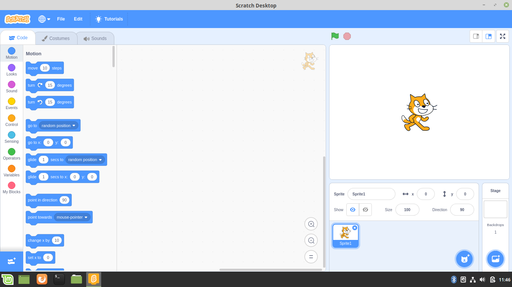
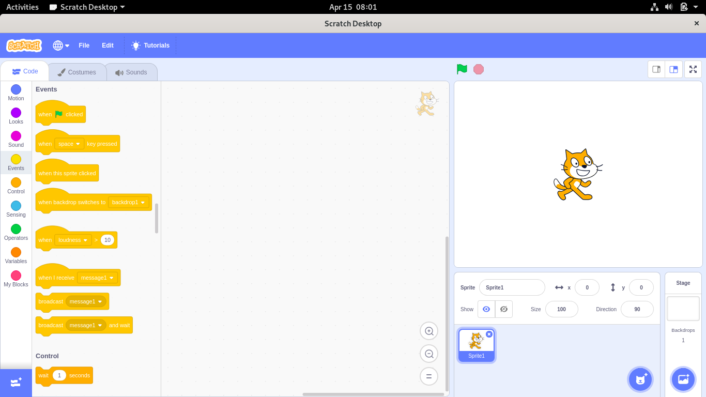

# Scratch Desktop 3.0 Offline Editor for Linux
As the offline version of Scratch 3.0 is not supported for the linux, this is the rebuild of the scratch desktop for debian based GNU Linux distributions like Ubuntu or Debian and for RPM based distributions like Fedora and OpenSUSE. Tested working without any issues.

## Installation
Go to https://github.com/redshaderobotics/scratch3.0-linux/releases
Installers for Debian based distributions and are available in deb format. For RPM distributions rpm installers are available in the release section.
### For Other Linux Distros
Download the archive from the releases. Unzip and run the command ./scratch-desktop to run the desktop.

## Supported/Tested Linux Distros
* Ubuntu 18.04.2
* Debian 9.8.0
* Linux Mint 19.1
* Fedora 30
* OpenSUSE Leap 15.0
* Ubuntu 14.04 (32 bit)

## Screenshot in Ubuntu 18.04.2

## Screenshot in Linux Mint 19.1

## Screenshot in Fedora 30

### License
BSD Clause 2 provided by the LLK

### Credit
We are very thankful for the work initiated by the github user @lyshie. Through his idea we started working on this release
of this linux version. His script and description is at https://gist.github.com/lyshie/0c49393076b8b375ca1bd98c28f95fb0
