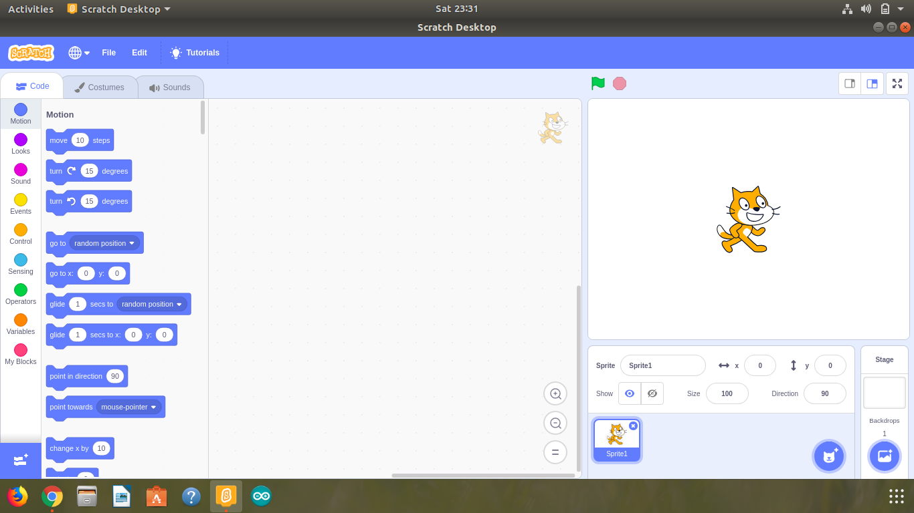

# Scratch Desktop 3.0 Offline Editor for Linux
As the offline version of Scratch 3.0 is not supported for the linux, this is the rebuild of the scratch desktop for debian based GNU Linux distributions like Ubuntu or Debian. Tested with Ubuntu 18.04.2, working without any issues.

## Installation
Download the deb file from the releases according to the architecture(amd64 or i386). Install using the software installer in ubuntu.

## Supported/Tested Linux Distros
* Ubuntu 
* Debian
* Mint

## Screenshot in Ubuntu 18.04.2

### License
BSD Clause 2 provided by the LLK
